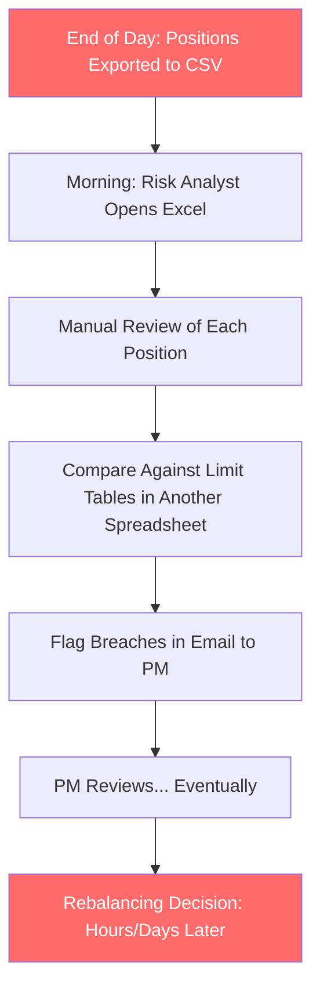

# 🏗️ PHASE 1 — PROBLEM ANALYSIS & DOMAIN EDUCATION

> **Hackathon**: Wissen Technology Hackathon 2026
> **Duration**: Saturday 10 AM – Sunday 4 PM (July 11–12, 2026 | ~31 hrs)
> **Team Size**: 4 engineers
> **LLM Stack**: Anthropic Claude API (one key per team)
> **Domain**: Financial Services — Portfolio Risk Management

---

## STEP 1 — UNDERSTANDING THE PROBLEM

### 1.1 Business Problem Being Solved

Portfolio managers and risk desks at financial institutions continuously manage **thousands of positions** across multiple accounts/funds. These positions span equities, bonds, derivatives, and cash. The core risk they must guard against is **concentration risk** — when too much of a portfolio is exposed to a single issuer, sector, geography, or correlated cluster.

**The problem today**: Monitoring is **periodic and reactive**. A risk analyst runs a batch report every morning, reviews it manually, and flags breaches. During the hours between reviews, breaches can **persist undetected** — creating regulatory violations, potential losses, and audit failures.

**What we're building**: An **AI-powered, real-time monitoring platform** that:
1. Ingests portfolio holdings continuously (real-time or batch)
2. Uses Claude AI to evaluate exposure against **configurable limits**
3. Classifies breach severity (LOW → CRITICAL)
4. Generates **human-readable rationale** for every alert
5. Triggers **automated escalation** to the right team
6. Maintains a **complete audit trail**

### 1.2 Who Are the Users

| User Role | What They Care About | How They Interact |
|-----------|---------------------|-------------------|
| **Portfolio Manager** | Position-level detail, rebalancing recommendations, performance impact | Dashboard, alerts, Jira tickets |
| **Risk Desk Analyst** | Breach severity, correlation clusters, systemic risk patterns | Real-time alerts, drill-down analysis |
| **Compliance Officer** | Regulatory limit adherence, audit trail completeness, historical records | Reports, audit logs |
| **Chief Risk Officer (CRO)** | Enterprise-wide risk posture, trend analysis, escalation effectiveness | Executive dashboards, summary reports |
| **Operations/Middle Office** | Data quality, position reconciliation, system health | System monitoring, data feeds |

### 1.3 Existing Workflow (Before Our System)



**Key Pain Points**:
- ⏰ **Latency**: 12-24 hour delay between breach occurrence and detection
- 🧠 **Cognitive Load**: Analyst manually reviews hundreds of positions across dozens of limits
- 📊 **No Rationale**: When a breach is flagged, the "why" requires manual investigation
- 🔕 **Silent Failures**: Correlation clusters and approaching-threshold positions go unnoticed
- 📝 **Audit Gaps**: Manual processes produce inconsistent, incomplete audit trails
- 🚫 **No Escalation Automation**: Alerts depend on humans remembering to email the right person

### 1.4 Hidden Assumptions in the Problem Statement

> [!IMPORTANT]
> These assumptions will critically shape our architecture:

1. **"Real-time or batch"** — The problem says both are acceptable, but the **evaluation criteria reward a working demo** (25%). Build batch-first, make it appear real-time via Kafka streaming.

2. **"Configurable limits"** — This is NOT a suggestion. Judges will test if your limits can be changed. Hard-coding limits = failed evaluation.

3. **"Multiple accounts/funds"** — The system must be multi-tenant aware. A single-portfolio demo misses the point.

4. **"At least two downstream actions"** — Minimum two, but the sample output shows THREE (Slack, Jira, Dashboard). Match or exceed the example.

5. **"Complete audit trail"** — Every analysis, every alert, every action must be logged with timestamps. This is a compliance requirement, not a nice-to-have.

6. **Claude must generate rationale** — The AI isn't just computing numbers. It must EXPLAIN the risk in natural language a PM can act on.

7. **Sample data** — They mention "provided sample data." If not given, we must generate realistic sample data ourselves.

### 1.5 Functional Requirements (Extracted)

| # | Requirement | Priority | Source |
|---|------------|----------|--------|
| FR-1 | Ingest portfolio holdings (equities, bonds, derivatives, cash) | P0 | Task 1 |
| FR-2 | Support multiple accounts/funds | P0 | Task 1 |
| FR-3 | Accept real-time or batch feed format | P0 | Task 1 |
| FR-4 | Normalize position data for downstream analysis | P0 | Task 1 |
| FR-5 | Evaluate portfolios against configurable concentration limits | P0 | Task 2 |
| FR-6 | Single issuer concentration check | P0 | Task 2 |
| FR-7 | Sector concentration check | P0 | Task 2 |
| FR-8 | Geography concentration check | P0 | Task 2 |
| FR-9 | Asset class concentration check | P0 | Task 2 |
| FR-10 | Correlation/volatility signal detection | P1 | Task 2 |
| FR-11 | Identify and explain limit breaches via Claude | P0 | Task 2 |
| FR-12 | Produce structured severity verdict (LOW/MEDIUM/HIGH/CRITICAL) | P0 | Task 3 |
| FR-13 | Generate confidence score per assessment | P0 | Task 3 |
| FR-14 | Claude generates human-readable rationale | P0 | Task 3 |
| FR-15 | Automated escalation based on severity | P0 | Task 4 |
| FR-16 | At least TWO downstream notification actions | P0 | Task 4 |
| FR-17 | Alert to correct desk/stakeholder | P0 | Task 4 |
| FR-18 | Complete audit trail for all assessments | P0 | Implicit |
| FR-19 | Configurable risk thresholds per fund/account | P0 | Task 2 |
| FR-20 | Dashboard for risk visualization | P1 | Sample Output |

### 1.6 Non-Functional Requirements

| # | Requirement | Target |
|---|------------|--------|
| NFR-1 | Response time for analysis | < 5 seconds per portfolio |
| NFR-2 | Claude API token efficiency | Minimize cost per analysis |
| NFR-3 | System availability during demo | 100% uptime |
| NFR-4 | Data consistency | No stale reads during streaming |
| NFR-5 | Audit log immutability | Append-only, timestamped |
| NFR-6 | Prompt reproducibility | Same input → consistent output |
| NFR-7 | Documentation quality | Setup in < 10 minutes |
| NFR-8 | Code quality | Clean architecture, SOLID |

### 1.7 Evaluation Criteria — DECODED

| Criteria | Weight | What Judges ACTUALLY Want | Our Strategy |
|----------|--------|--------------------------|--------------|
| **AI Exposure Analysis & Rationale** | **25%** | Claude does meaningful analysis, not just formatting. Rationale reads like a risk analyst wrote it. | Prompt engineering with few-shot examples. Structured output with Pydantic models. Chain-of-thought reasoning in prompts. |
| **Working Demo** | **25%** | End-to-end flow: ingest → analyze → score → alert. Must work LIVE with sample data. | Build the happy path FIRST. Polish the demo flow. Pre-load sample data. Rehearse. |
| **Automation & Escalation** | **20%** | Multiple notification channels actually fire. Not just "we would send an email." | Email via SMTP, Jira via API, Dashboard push via WebSocket. Show all three in demo. |
| **Risk Model Quality** | **15%** | Handles edge cases: empty portfolio, 100% single stock, conflicting signals, threshold boundary values. | Build a rule engine that handles edge cases. Claude validates rule engine output. |
| **API Efficiency** | **10%** | Smart prompt design. Caching. Batching. Not calling Claude for every trivial check. | Pre-filter with rules engine. Only call Claude for genuine analysis. Cache similar portfolio patterns. |
| **Docs / README** | **5%** | Clear architecture diagram. One-command setup. API docs. | Generate docs continuously. Include Mermaid diagrams. Docker Compose one-command setup. |

### 1.8 What Differentiates a WINNING Solution

> [!TIP]
> **Average teams** build a CRUD app that calls Claude and shows results.
> **Winning teams** build a system that *thinks like a risk analyst*.

| Dimension | Average Solution | Winning Solution |
|-----------|-----------------|------------------|
| **Data Ingestion** | Manual JSON upload | Kafka streaming + batch upload + Yahoo Finance live prices |
| **AI Analysis** | Single Claude call, dump everything | Multi-stage: rule engine pre-filter → Claude deep analysis → structured output |
| **Rationale** | "Issuer X exceeds limit" | "Reliance at 9.8% NAV (limit: 8%) — 30d vol up 40% QoQ, similar Q1 breaches preceded 2-day rebalancing lag. Correlated with 2 other energy holdings." |
| **Escalation** | Console.log("alert sent") | Actual email delivery + Jira ticket creation + WebSocket dashboard push |
| **Demo** | Developer explains while clicking | Self-running demo: data streams in, alerts pop up in real-time, tickets appear in Jira |
| **Edge Cases** | Crashes on empty data | Gracefully handles: empty portfolio, missing prices, rate limits, network failures |
| **Architecture** | Monolith script | Event-driven microservices with Kafka, proper separation of concerns |

### 1.9 Edge Cases to Handle

1. **Empty portfolio** — No positions to analyze
2. **Single-asset portfolio** — 100% in one stock (always a breach)
3. **Missing market data** — Yahoo Finance returns null for a ticker
4. **Threshold exactly at boundary** — Is 8.0% a breach of 8.0% limit? (No — it's AT limit, not OVER)
5. **Multiple simultaneous breaches** — Issuer AND sector AND geography all breached
6. **Correlated positions with low individual weight** — Each position is 3%, but 10 positions in the same sector = 30%
7. **Currency effects** — Positions in different currencies affect NAV calculation
8. **Claude API rate limiting** — What happens when we hit the rate limit mid-analysis?
9. **Stale data** — Portfolio positions that haven't been updated
10. **Rapid position changes** — Position changes faster than analysis can complete

---

## STEP 2 — FINANCIAL DOMAIN EDUCATION

> 🎓 **For engineers with no finance background**: This section teaches you the concepts you'll implement.

### 2.1 Portfolio Management — The Basics

A **portfolio** is simply a collection of financial assets (stocks, bonds, derivatives, cash) held by an investor or fund. Think of it as a shopping cart of investments.

```
Portfolio: "Alpha Growth Fund"
├── 200 shares of AAPL     (Apple Inc.)         → $42,000
├── 1000 shares of RELIANCE (Reliance Industries) → $28,000
├── $50,000 in US Treasury Bonds                 → $50,000
├── 500 shares of TSLA     (Tesla)               → $35,000
├── Cash                                          → $45,000
└── Total Portfolio Value (NAV)                   → $200,000
```

### 2.2 Key Concepts Explained

#### **NAV (Net Asset Value)**
The total value of all assets in a portfolio. Updated in real-time as market prices change.
```
NAV = Σ (quantity × current_price) for all positions + cash
```

#### **Exposure**
How much of your portfolio is "exposed" to a specific risk factor. Always expressed as a **percentage of NAV**.
```
AAPL Exposure = $42,000 / $200,000 = 21% of NAV
```

#### **Concentration**
When a portfolio has too much exposure to any single dimension. This is the CORE problem we're solving.

**Types of Concentration**:

| Type | Question | Example | Typical Limit |
|------|----------|---------|--------------|
| **Issuer Concentration** | How much of my portfolio is in one company? | 21% in Apple | 8-10% max per issuer |
| **Sector Concentration** | How much is in one industry? | 35% in Technology | 25-30% max per sector |
| **Country/Geography** | How much is in one country? | 70% in India | 60-70% max per country |
| **Asset Class** | How much is in one type of asset? | 80% in equities | Varies by fund mandate |
| **Correlation Cluster** | How many of my holdings move together? | 5 stocks all correlated >0.85 | Flag when >3 holdings correlate |

#### **Volatility**
How much a stock price jumps around. Higher volatility = higher risk.
```
30-day realized volatility = Standard deviation of daily returns over 30 days
If RELIANCE has 40% higher volatility this quarter vs last quarter → RED FLAG
```

#### **Correlation Risk**
When multiple holdings move in the same direction. If stocks A, B, and C are all 85% correlated, owning all three is like owning one stock three times — you're NOT diversified.
```
Correlation coefficient: 0.0 = no relationship, 1.0 = perfectly correlated
Threshold: >0.85 rolling 30-day = FLAGGED
```

#### **Risk Thresholds / Risk Limits**
Pre-defined boundaries set by the fund's compliance team. Exceeding a limit is a **breach** that requires action.
```yaml
risk_limits:
  single_issuer_max: 8.0%    # No single company > 8% of NAV
  sector_max: 25.0%          # No single sector > 25% of NAV
  geography_max: 70.0%       # No single country > 70% of NAV
  asset_class_max: 60.0%     # No single asset class > 60% of NAV
  correlation_threshold: 0.85 # Flag when >3 holdings exceed this
  warning_buffer: 3.0%       # Warn when within 3% of limit
```

#### **Rebalancing**
The act of buying/selling positions to bring the portfolio back within risk limits after a breach.
```
Before: RELIANCE at 9.8% NAV (limit: 8.0%) → BREACH
Action: Sell some RELIANCE shares
After: RELIANCE at 7.5% NAV → COMPLIANT ✓
```

#### **Risk Desk**
The team at a financial institution that monitors risk in real-time and has authority to halt trading or force rebalancing. They're our PRIMARY user.

#### **Risk Scoring**
Translating a set of risk signals into a single severity verdict:
```
CRITICAL = Active breach + High volatility + Multiple correlated positions
HIGH     = Active breach on a major limit
MEDIUM   = Approaching threshold + Warning signals
LOW      = Minor advisory, no immediate action needed
```

#### **Audit Trail**
Every analysis, every alert, every action — timestamped and stored permanently. Regulators (SEC, SEBI, FCA) can demand this data at any time.

### 2.3 Industry Solutions — Competitive Landscape

#### **BlackRock Aladdin** 🏆
- **What it does**: End-to-end investment management platform used by 200+ institutions managing $21.6 trillion
- **Strengths**: Unified data model, 5000+ daily risk scenarios, integrated trading + compliance + risk
- **Weaknesses**: Massively expensive ($50M+ annual license), 12-18 month implementation, NOT AI-native
- **Our Advantage**: AI-generated rationale. Aladdin shows numbers; we EXPLAIN them.

#### **Bloomberg PORT** 📊
- **What it does**: Portfolio analytics on Bloomberg Terminal — factor-based risk decomposition
- **Strengths**: MAC3 cross-asset risk models, real-time VaR, stress testing
- **Recently added**: AI Portfolio Commentary (Sept 2025) — auto-generates explanations
- **Weaknesses**: Locked to Bloomberg Terminal ($25K/year/seat), no automated escalation workflow
- **Our Advantage**: Open architecture, automated escalation, configurable limits per fund

#### **FactSet** 📈
- **What it does**: Portfolio analytics, attribution, risk analysis for buy-side firms
- **Strengths**: Flexible reporting, strong fixed-income analytics
- **Weaknesses**: Limited real-time streaming, no AI-powered explanations, manual alerting
- **Our Advantage**: Real-time Kafka streaming, Claude-powered rationale, automated actions

#### **MSCI RiskMetrics** ⚡
- **What it does**: Multi-asset risk models, factor-based risk analytics
- **Strengths**: Industry-standard risk models, regulatory acceptance
- **Weaknesses**: Model outputs require expert interpretation, no natural language explanations
- **Our Advantage**: Claude translates complex risk math into actionable English

#### **Morningstar Direct** 🌟
- **What it does**: Investment analysis, portfolio construction, manager research
- **Strengths**: Great for mutual fund analysis, Morningstar ratings
- **Weaknesses**: Not designed for real-time risk monitoring, limited institutional workflows
- **Our Advantage**: Purpose-built for real-time concentration monitoring

### 2.4 Innovation Gaps We Can Fill

| Gap in Industry | Our Innovation |
|----------------|---------------|
| Risk tools show WHAT happened, not WHY | Claude generates contextual rationale with historical pattern recognition |
| Alerts are passive (dashboard turns red) | Active escalation: email + Jira + Slack + dashboard simultaneously |
| Thresholds are global, not fund-specific | Per-fund, per-account configurable limits with inheritance |
| Correlation analysis requires quant expertise | Claude explains correlation clusters in plain English |
| Audit trails are separate systems | Built-in, immutable audit log with full analysis replay |
| No AI confidence scoring | Every assessment has a confidence score explaining uncertainty |
| Rebalancing suggestions require manual analysis | Claude suggests specific rebalancing actions with estimated impact |

### 2.5 Real-World Example Walkthrough

**Scenario**: Alpha Growth Fund holds these positions:

```
Fund: Alpha Growth Opportunities Fund (NAV: ₹100 Cr)
┌──────────────────────┬──────────┬────────┬──────────┬──────────┐
│ Holding              │ Sector   │ Country│ Value(Cr)│ % of NAV │
├──────────────────────┼──────────┼────────┼──────────┼──────────┤
│ Reliance Industries  │ Energy   │ India  │ 9.8      │ 9.8%     │
│ ONGC                 │ Energy   │ India  │ 7.2      │ 7.2%     │
│ Indian Oil Corp      │ Energy   │ India  │ 5.4      │ 5.4%     │
│ TCS                  │ IT       │ India  │ 6.5      │ 6.5%     │
│ Infosys              │ IT       │ India  │ 5.0      │ 5.0%     │
│ HDFC Bank            │ Banking  │ India  │ 7.5      │ 7.5%     │
│ ICICI Bank           │ Banking  │ India  │ 6.0      │ 6.0%     │
│ Apple Inc            │ Tech     │ USA    │ 5.5      │ 5.5%     │
│ Microsoft            │ Tech     │ USA    │ 4.5      │ 4.5%     │
│ US Treasury Bonds    │ Govt Bond│ USA    │ 12.0     │ 12.0%    │
│ Cash                 │ Cash     │ India  │ 30.6     │ 30.6%    │
└──────────────────────┴──────────┴────────┴──────────┴──────────┘

Risk Limits: Issuer: 8%, Sector: 25%, Geography: 70%

Analysis:
┌──────────────────────┬───────────┬───────┬──────────────────────────┐
│ Check                │ Value     │ Limit │ Status                   │
├──────────────────────┼───────────┼───────┼──────────────────────────┤
│ Issuer: Reliance     │ 9.8%      │ 8.0%  │ ❌ BREACH (+1.8%)        │
│ Sector: Energy       │ 22.4%     │ 25.0% │ ⚠️ WARNING (2.6% buffer) │
│ Geography: India     │ 61.0%     │ 70.0% │ ✅ OK (9.0% buffer)      │
│ Geography: USA       │ 22.0%     │ 70.0% │ ✅ OK                    │
│ Correlation Cluster  │ RIL,ONGC,IOC │ 0.85 │ 🚩 FLAGGED (>0.85)     │
└──────────────────────┴───────────┴───────┴──────────────────────────┘

Claude's Verdict: HIGH RISK — IMMEDIATE REBALANCING REVIEW
Confidence: 91%
```

---

## SUMMARY — What We Now Know

1. ✅ **Business problem**: Real-time portfolio concentration monitoring with AI-powered explanations
2. ✅ **Users**: Portfolio managers, risk desks, compliance officers
3. ✅ **Current pain**: Manual, periodic, reactive reviews with 12-24hr detection lag
4. ✅ **Evaluation weights**: AI Quality (25%) + Working Demo (25%) + Automation (20%) + Risk Model (15%) + API Efficiency (10%) + Docs (5%)
5. ✅ **Key differentiator**: Claude doesn't just detect breaches — it EXPLAINS them with context
6. ✅ **Industry gap**: No existing tool combines real-time streaming + AI rationale + automated escalation + audit trail
7. ✅ **Tech stack**: FastAPI, React, MongoDB, Kafka, LangChain, LangSmith, Yahoo Finance, Claude API

---

> **Ready for Phase 2?** — Product Design, System Architecture, and Project Structure
