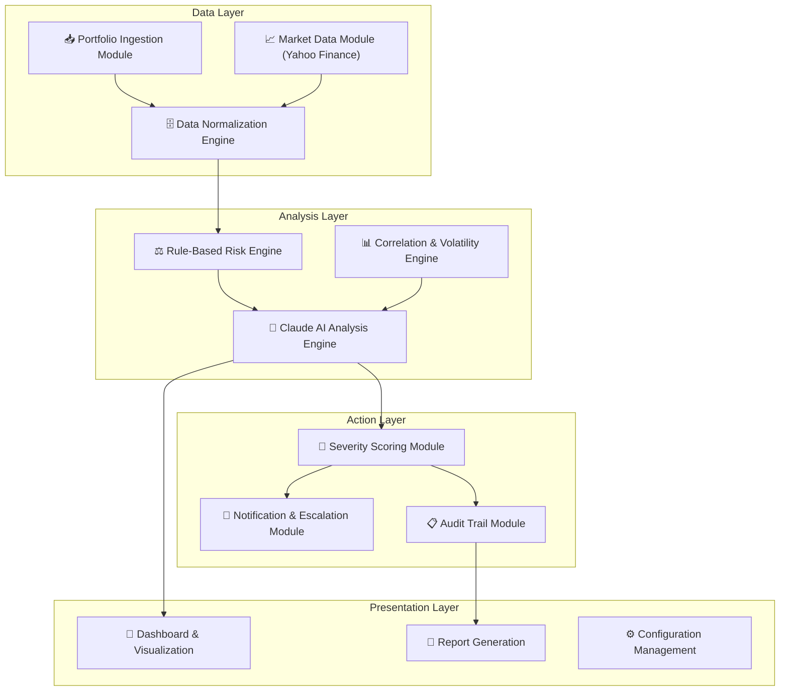
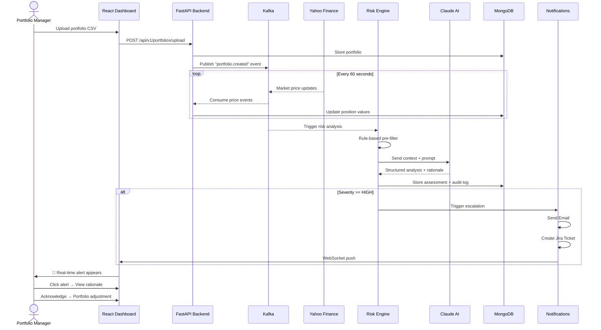
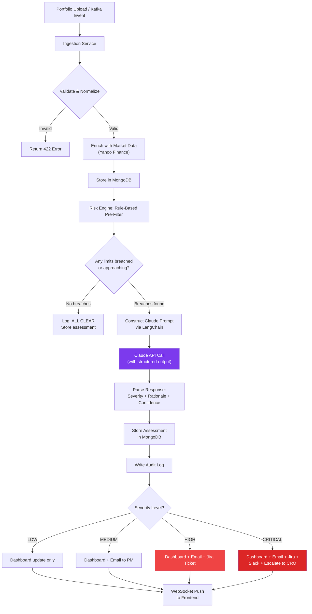
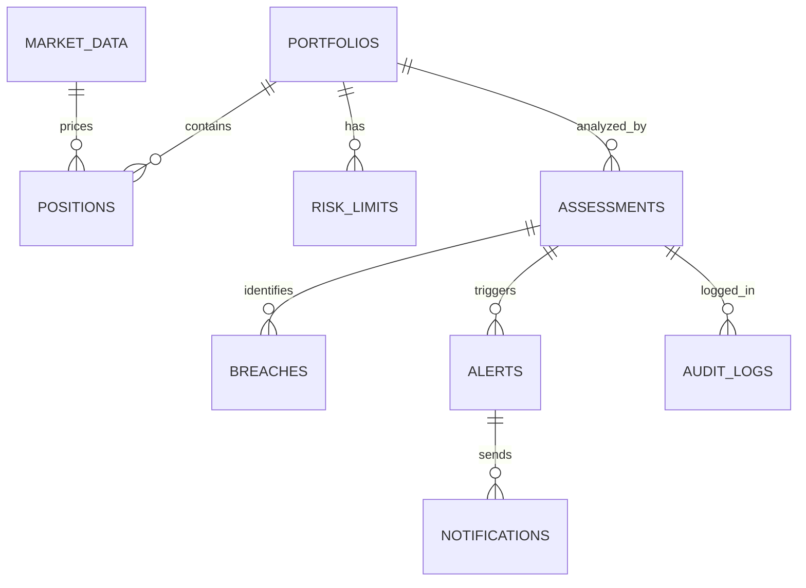

# 🏗️ PHASE 2 — PRODUCT DESIGN, ARCHITECTURE & ENGINEERING PLAN

> **Project Name**: **RiskLens AI** — Real-Time Portfolio Risk & Concentration Alert System
> **Tagline**: *"See the risk before it sees you."*

---

## STEP 3 — PRODUCT DESIGN

### 3.1 Problem Statement (Product Perspective)

Financial institutions monitor portfolio risk manually, with batch reports that create 12-24 hour blind spots. During these gaps, concentration breaches persist undetected — creating regulatory exposure, potential losses, and audit failures. RiskLens AI eliminates this gap with real-time, AI-explained risk monitoring.

### 3.2 Vision

> Build the world's first **AI-native portfolio risk monitor** that doesn't just detect breaches — it **explains them like a senior risk analyst**, and **acts on them automatically**.

### 3.3 Target Users & Personas

#### Persona 1: Ananya — Portfolio Manager
```
Role: Portfolio Manager at a mid-cap equity fund
Experience: 8 years | Manages: ₹500 Cr AUM across 3 funds
Pain: Gets emailed a PDF every morning — by the time she reads it, market has moved
Wants: Real-time alerts on her phone, clear "what should I do" recommendations
Tech comfort: Uses Bloomberg Terminal daily, comfortable with dashboards
```

#### Persona 2: Raj — Risk Desk Analyst
```
Role: Risk Analyst on the centralized risk desk
Experience: 4 years | Monitors: 12 funds, 2000+ positions
Pain: Manually compares positions against 50+ limit rules in Excel every day
Wants: A system that does the comparison automatically and explains anomalies
Tech comfort: Writes VBA macros, understands risk math
```

#### Persona 3: Meera — Chief Compliance Officer
```
Role: Head of Compliance
Experience: 15 years | Regulatory bodies: SEBI, SEC
Pain: Audit preparation takes weeks. Cannot prove when a breach was detected.
Wants: Complete, timestamped, immutable audit trail of every assessment
Tech comfort: Needs simple reports, not complex dashboards
```

### 3.4 User Stories

#### Epic 1: Portfolio Data Ingestion
| ID | Story | Priority | Acceptance Criteria |
|----|-------|----------|-------------------|
| US-1.1 | As a risk analyst, I want to upload portfolio holdings via CSV/JSON so the system can analyze them | P0 | File upload + validation + confirmation |
| US-1.2 | As a system, I want to stream market data from Yahoo Finance every minute so positions reflect current prices | P0 | Kafka consumer processes price updates |
| US-1.3 | As a PM, I want to see multiple funds/accounts separately so I can compare risk across my portfolios | P0 | Multi-fund support with fund selector |

#### Epic 2: AI-Powered Risk Analysis
| ID | Story | Priority | Acceptance Criteria |
|----|-------|----------|-------------------|
| US-2.1 | As a risk analyst, I want the system to automatically check all concentration limits so I don't have to do it manually | P0 | Rule engine checks issuer/sector/geo/asset class |
| US-2.2 | As a PM, I want Claude to explain WHY a position is risky, not just flag it | P0 | Natural language rationale for every alert |
| US-2.3 | As a risk analyst, I want to configure risk thresholds per fund so different funds have different rules | P0 | CRUD for risk limits per fund |
| US-2.4 | As a PM, I want to see correlation clusters so I understand hidden concentration | P1 | Correlation matrix with flagged clusters |

#### Epic 3: Severity & Alerting
| ID | Story | Priority | Acceptance Criteria |
|----|-------|----------|-------------------|
| US-3.1 | As a risk desk, I want severity scores (LOW/MED/HIGH/CRITICAL) so I can prioritize my response | P0 | Structured verdict with confidence score |
| US-3.2 | As a risk desk, I want automatic email alerts for HIGH/CRITICAL breaches | P0 | Email sent within 30 seconds of detection |
| US-3.3 | As a PM, I want Jira tickets created automatically for breaches requiring action | P0 | Jira ticket with breach details |
| US-3.4 | As a compliance officer, I want every assessment logged in an audit trail | P0 | Immutable log with timestamp + input + output |

#### Epic 4: Dashboard & Visualization
| ID | Story | Priority | Acceptance Criteria |
|----|-------|----------|-------------------|
| US-4.1 | As a PM, I want a real-time dashboard showing my portfolio's risk status | P0 | Dashboard with live updates via WebSocket |
| US-4.2 | As a risk desk, I want to drill down into any alert to see full analysis | P1 | Alert detail view with Claude rationale |
| US-4.3 | As a CRO, I want a summary view across all funds | P1 | Multi-fund overview with risk heatmap |

### 3.5 System Goals

```
┌─────────────────────────────────────────────────────────────┐
│                     SYSTEM GOALS                            │
├─────────────────────┬───────────────────────────────────────┤
│ Real-time Detection │ < 60s from price change to alert      │
│ AI Explanation      │ Every alert has Claude rationale      │
│ Automation          │ 3+ escalation channels fire auto      │
│ Audit Completeness  │ 100% of assessments logged            │
│ Configurability     │ All limits adjustable per fund        │
│ Demo Reliability    │ Works flawlessly in live demo         │
│ Cost Efficiency     │ < $5 in Claude API costs for demo     │
└─────────────────────┴───────────────────────────────────────┘
```

### 3.6 Functional Modules



### 3.7 Screen Inventory

| # | Screen | Purpose | Priority |
|---|--------|---------|----------|
| S1 | **Dashboard Home** | Fund overview, risk heatmap, active alerts count | P0 |
| S2 | **Portfolio Detail** | Positions table, concentration bars, limit status | P0 |
| S3 | **Alert Feed** | Real-time alert stream with severity badges | P0 |
| S4 | **Alert Detail** | Full Claude analysis, rationale, actions taken | P0 |
| S5 | **Risk Configuration** | Edit limits per fund, thresholds, notification preferences | P0 |
| S6 | **Audit Log** | Searchable, filterable history of all assessments | P0 |
| S7 | **Upload Portfolio** | CSV/JSON upload with validation feedback | P0 |
| S8 | **Correlation Explorer** | Interactive correlation matrix with cluster highlighting | P1 |
| S9 | **XAI Report** | Explainable AI report with LangSmith trace links | P1 |

### 3.8 User Journey — Critical Demo Flow



---

## STEP 4 — SOFTWARE ARCHITECTURE

### 4.1 High-Level Architecture

```
┌─────────────────────────────────────────────────────────────────────────────────┐
│                              RiskLens AI Architecture                           │
│                                                                                 │
│  ┌──────────────┐    ┌──────────────┐    ┌──────────────────────────────────┐   │
│  │ Yahoo Finance │    │  CSV/JSON    │    │        React Frontend            │   │
│  │   API Feed    │    │   Upload     │    │  ┌────────┐ ┌───────┐ ┌──────┐  │   │
│  └──────┬───────┘    └──────┬───────┘    │  │Dashboard│ │Alerts │ │Config│  │   │
│         │                   │             │  └────────┘ └───────┘ └──────┘  │   │
│         ▼                   ▼             │         ▲ WebSocket              │   │
│  ┌──────────────────────────────────┐    └─────────┼───────────────────────┘   │
│  │         Apache Kafka              │             │                           │
│  │  ┌──────────┐ ┌───────────────┐  │             │                           │
│  │  │ market.  │ │  portfolio.   │  │             │                           │
│  │  │ prices   │ │  events       │  │             │                           │
│  │  └────┬─────┘ └───────┬───────┘  │             │                           │
│  └───────┼───────────────┼──────────┘             │                           │
│          │               │                         │                           │
│          ▼               ▼                         │                           │
│  ┌──────────────────────────────────────────────────────────────┐              │
│  │                    FastAPI Backend                            │              │
│  │                                                              │              │
│  │  ┌─────────────┐  ┌──────────────┐  ┌───────────────────┐  │              │
│  │  │ Ingestion   │  │ Risk Engine  │  │ Notification Svc  │  │              │
│  │  │ Service     │  │              │  │                   │  │              │
│  │  │ • Normalize │  │ • Rule-Based │  │ • Email (SMTP)    │  │              │
│  │  │ • Validate  │  │   Pre-filter │  │ • Jira API        │  │              │
│  │  │ • Enrich    │  │ • Claude AI  │  │ • WebSocket Push  │  │              │
│  │  └──────┬──────┘  │   via        │  │ • Audit Logger    │  │              │
│  │         │         │   LangChain  │  └───────────────────┘  │              │
│  │         │         │ • Severity   │                          │              │
│  │         │         │   Scoring    │         LangSmith        │              │
│  │         │         └──────────────┘       (Observability)    │              │
│  │         │                │                     │            │              │
│  └─────────┼────────────────┼─────────────────────┼────────────┘              │
│            │                │                     │                            │
│            ▼                ▼                     ▼                            │
│  ┌──────────────────────────────────────────────────────┐                     │
│  │                    MongoDB Atlas                      │                     │
│  │  portfolios │ positions │ assessments │ audit_logs    │                     │
│  │  alerts     │ risk_limits│ notifications│ market_data  │                     │
│  └──────────────────────────────────────────────────────┘                     │
└─────────────────────────────────────────────────────────────────────────────────┘
```

### 4.2 Component Architecture (Clean Architecture)

```
┌─────────────────────────────────────────────────────┐
│                    FastAPI Backend                    │
│                                                      │
│  ┌─────────────────────────────────────────────────┐│
│  │              API Layer (Controllers)             ││
│  │  portfolio_controller │ risk_controller          ││
│  │  alert_controller     │ config_controller        ││
│  │  audit_controller     │ health_controller        ││
│  └────────────────────┬────────────────────────────┘│
│                       │                              │
│  ┌────────────────────▼────────────────────────────┐│
│  │              Service Layer (Business Logic)      ││
│  │  ingestion_service    │ risk_analysis_service    ││
│  │  notification_service │ scoring_service          ││
│  │  audit_service        │ market_data_service      ││
│  └────────────────────┬────────────────────────────┘│
│                       │                              │
│  ┌────────────────────▼────────────────────────────┐│
│  │              Domain Layer (Models + Rules)       ││
│  │  portfolio_model      │ risk_rules_engine        ││
│  │  alert_model          │ severity_calculator      ││
│  │  concentration_model  │ correlation_engine       ││
│  └────────────────────┬────────────────────────────┘│
│                       │                              │
│  ┌────────────────────▼────────────────────────────┐│
│  │         Infrastructure Layer (External I/O)      ││
│  │  mongo_repository     │ kafka_producer/consumer  ││
│  │  claude_client        │ yahoo_finance_client     ││
│  │  email_client         │ jira_client              ││
│  │  langsmith_tracer     │ websocket_manager        ││
│  └─────────────────────────────────────────────────┘│
└─────────────────────────────────────────────────────┘
```

### 4.3 Request Flow — Portfolio Analysis



### 4.4 Kafka Topics & Event Flow

```
┌─────────────────────────────────────────────────────┐
│                   Kafka Topics                       │
├─────────────────────────────────────────────────────┤
│                                                      │
│  market.prices.realtime                              │
│  ├── Producer: Yahoo Finance Scheduler (every 60s)   │
│  └── Consumer: MarketDataService                     │
│                                                      │
│  portfolio.events                                    │
│  ├── Producer: IngestionService                      │
│  ├── Events: portfolio.created                       │
│  │           portfolio.updated                       │
│  │           portfolio.positions.changed             │
│  └── Consumer: RiskAnalysisService                   │
│                                                      │
│  risk.assessments                                    │
│  ├── Producer: RiskAnalysisService                   │
│  ├── Events: assessment.completed                    │
│  │           breach.detected                         │
│  └── Consumer: NotificationService, AuditService     │
│                                                      │
│  notifications.outbound                              │
│  ├── Producer: NotificationService                   │
│  ├── Events: email.queued                            │
│  │           jira.ticket.created                     │
│  │           websocket.push                          │
│  └── Consumer: EmailWorker, JiraWorker               │
│                                                      │
└─────────────────────────────────────────────────────┘
```

### 4.5 Authentication Flow (Simplified for Hackathon)

```
For hackathon scope: API Key-based authentication
┌────────┐     ┌──────────┐     ┌──────────┐
│ Client │────▶│ API Key  │────▶│ FastAPI  │
│        │     │ Middleware│     │ Handler  │
└────────┘     └──────────┘     └──────────┘

API Key passed via header: X-API-Key: <key>
Stored in environment variable: RISKLENS_API_KEY
```

> [!NOTE]
> For a hackathon, full OAuth/JWT is over-engineering. API key auth is sufficient and lets us focus on the core product. Mention JWT as "production roadmap" in the presentation.

### 4.6 Deployment Architecture

```
┌──────────────────────────────────────────────┐
│              Docker Compose Stack             │
│                                               │
│  ┌─────────────────┐  ┌──────────────────┐  │
│  │  risklens-api    │  │  risklens-ui     │  │
│  │  (FastAPI)       │  │  (React/Vite)    │  │
│  │  Port: 8000      │  │  Port: 3000      │  │
│  └─────────────────┘  └──────────────────┘  │
│                                               │
│  ┌─────────────────┐  ┌──────────────────┐  │
│  │  kafka           │  │  zookeeper       │  │
│  │  Port: 9092      │  │  Port: 2181      │  │
│  └─────────────────┘  └──────────────────┘  │
│                                               │
│  ┌─────────────────┐  ┌──────────────────┐  │
│  │  mongodb         │  │  mongo-express   │  │
│  │  Port: 27017     │  │  Port: 8081      │  │
│  └─────────────────┘  └──────────────────┘  │
│                                               │
│  ┌─────────────────┐                         │
│  │  kafka-ui        │                         │
│  │  Port: 8082      │                         │
│  └─────────────────┘                         │
└──────────────────────────────────────────────┘

Single command: docker-compose up --build
```

---

## STEP 5 — PROJECT STRUCTURE

### 5.1 Complete Repository Structure

```
risklens-ai/
│
├── 📁 backend/                          # FastAPI Application
│   ├── 📁 app/
│   │   ├── 📁 api/                      # API Layer (Controllers + Routes)
│   │   │   ├── 📁 v1/
│   │   │   │   ├── __init__.py
│   │   │   │   ├── portfolio.py         # Portfolio CRUD endpoints
│   │   │   │   ├── risk.py              # Risk analysis endpoints
│   │   │   │   ├── alerts.py            # Alert management endpoints
│   │   │   │   ├── config.py            # Risk config endpoints
│   │   │   │   ├── audit.py             # Audit log endpoints
│   │   │   │   ├── market.py            # Market data endpoints
│   │   │   │   └── health.py            # Health check endpoint
│   │   │   ├── __init__.py
│   │   │   ├── router.py               # Main API router aggregator
│   │   │   └── dependencies.py          # FastAPI dependency injection
│   │   │
│   │   ├── 📁 services/                 # Business Logic Layer
│   │   │   ├── __init__.py
│   │   │   ├── ingestion_service.py     # Portfolio ingestion + normalization
│   │   │   ├── risk_analysis_service.py # Orchestrates rule engine + Claude
│   │   │   ├── scoring_service.py       # Severity scoring logic
│   │   │   ├── notification_service.py  # Email, Jira, WebSocket dispatch
│   │   │   ├── market_data_service.py   # Yahoo Finance integration
│   │   │   ├── audit_service.py         # Audit trail management
│   │   │   └── config_service.py        # Risk limits CRUD
│   │   │
│   │   ├── 📁 domain/                   # Domain Models & Business Rules
│   │   │   ├── __init__.py
│   │   │   ├── models/
│   │   │   │   ├── __init__.py
│   │   │   │   ├── portfolio.py         # Portfolio, Position, Fund models
│   │   │   │   ├── risk.py              # RiskAssessment, Breach, Alert models
│   │   │   │   ├── audit.py             # AuditLog model
│   │   │   │   └── config.py            # RiskLimits, NotificationConfig models
│   │   │   ├── enums.py                 # Severity, AssetClass, Sector enums
│   │   │   └── rules/
│   │   │       ├── __init__.py
│   │   │       ├── concentration_rules.py  # Issuer/Sector/Geo/AssetClass rules
│   │   │       ├── correlation_rules.py    # Correlation cluster detection
│   │   │       └── severity_rules.py       # Severity classification logic
│   │   │
│   │   ├── 📁 infrastructure/           # External I/O Layer
│   │   │   ├── __init__.py
│   │   │   ├── database/
│   │   │   │   ├── __init__.py
│   │   │   │   ├── mongodb.py           # MongoDB connection + client
│   │   │   │   └── repositories/
│   │   │   │       ├── __init__.py
│   │   │   │       ├── portfolio_repo.py
│   │   │   │       ├── assessment_repo.py
│   │   │   │       ├── alert_repo.py
│   │   │   │       ├── audit_repo.py
│   │   │   │       └── config_repo.py
│   │   │   ├── kafka/
│   │   │   │   ├── __init__.py
│   │   │   │   ├── producer.py          # Kafka event publisher
│   │   │   │   ├── consumer.py          # Kafka event consumer
│   │   │   │   └── topics.py            # Topic name constants
│   │   │   ├── ai/
│   │   │   │   ├── __init__.py
│   │   │   │   ├── claude_client.py     # LangChain Claude wrapper
│   │   │   │   ├── prompt_templates.py  # All prompt templates
│   │   │   │   ├── output_parsers.py    # Structured output Pydantic parsers
│   │   │   │   └── langsmith_config.py  # LangSmith tracing setup
│   │   │   ├── external/
│   │   │   │   ├── __init__.py
│   │   │   │   ├── yahoo_finance.py     # Yahoo Finance API client
│   │   │   │   ├── email_client.py      # SMTP email sender
│   │   │   │   └── jira_client.py       # Jira REST API client
│   │   │   └── websocket/
│   │   │       ├── __init__.py
│   │   │       └── manager.py           # WebSocket connection manager
│   │   │
│   │   ├── 📁 middleware/               # FastAPI Middleware
│   │   │   ├── __init__.py
│   │   │   ├── auth.py                  # API key authentication
│   │   │   ├── logging.py              # Request/response logging
│   │   │   ├── error_handler.py         # Global exception handler
│   │   │   └── cors.py                  # CORS configuration
│   │   │
│   │   ├── 📁 schemas/                  # Pydantic Request/Response schemas
│   │   │   ├── __init__.py
│   │   │   ├── portfolio_schemas.py
│   │   │   ├── risk_schemas.py
│   │   │   ├── alert_schemas.py
│   │   │   ├── config_schemas.py
│   │   │   └── common_schemas.py
│   │   │
│   │   ├── 📁 workers/                  # Background Workers
│   │   │   ├── __init__.py
│   │   │   ├── market_data_worker.py    # Yahoo Finance polling worker
│   │   │   ├── risk_analysis_worker.py  # Kafka consumer for risk analysis
│   │   │   └── notification_worker.py   # Notification dispatch worker
│   │   │
│   │   ├── 📁 core/                     # App Configuration
│   │   │   ├── __init__.py
│   │   │   ├── config.py               # Pydantic Settings (env vars)
│   │   │   ├── constants.py            # App-wide constants
│   │   │   └── logger.py              # Structured logging setup
│   │   │
│   │   └── main.py                      # FastAPI app entry point
│   │
│   ├── 📁 tests/
│   │   ├── __init__.py
│   │   ├── conftest.py                  # Test fixtures
│   │   ├── test_risk_engine.py
│   │   ├── test_scoring.py
│   │   ├── test_ingestion.py
│   │   └── test_api.py
│   │
│   ├── requirements.txt
│   ├── requirements-dev.txt
│   ├── Dockerfile
│   ├── pyproject.toml
│   └── .env.example
│
├── 📁 frontend/                         # React Application
│   ├── 📁 public/
│   │   ├── favicon.ico
│   │   └── index.html
│   ├── 📁 src/
│   │   ├── 📁 components/              # Reusable UI Components
│   │   │   ├── 📁 common/
│   │   │   │   ├── Navbar.jsx
│   │   │   │   ├── Sidebar.jsx
│   │   │   │   ├── StatusBadge.jsx
│   │   │   │   ├── SeverityChip.jsx
│   │   │   │   ├── LoadingSpinner.jsx
│   │   │   │   └── ErrorBoundary.jsx
│   │   │   ├── 📁 dashboard/
│   │   │   │   ├── RiskHeatmap.jsx
│   │   │   │   ├── PortfolioSummaryCard.jsx
│   │   │   │   ├── AlertTicker.jsx
│   │   │   │   ├── ConcentrationBars.jsx
│   │   │   │   └── RiskTrendChart.jsx
│   │   │   ├── 📁 alerts/
│   │   │   │   ├── AlertFeed.jsx
│   │   │   │   ├── AlertDetailModal.jsx
│   │   │   │   └── AlertActions.jsx
│   │   │   ├── 📁 portfolio/
│   │   │   │   ├── PositionsTable.jsx
│   │   │   │   ├── PortfolioUpload.jsx
│   │   │   │   ├── FundSelector.jsx
│   │   │   │   └── ConcentrationPieChart.jsx
│   │   │   ├── 📁 config/
│   │   │   │   ├── RiskLimitsForm.jsx
│   │   │   │   └── NotificationSettings.jsx
│   │   │   └── 📁 audit/
│   │   │       ├── AuditLogTable.jsx
│   │   │       └── AuditDetailDrawer.jsx
│   │   │
│   │   ├── 📁 pages/                   # Route Pages
│   │   │   ├── Dashboard.jsx
│   │   │   ├── Alerts.jsx
│   │   │   ├── PortfolioDetail.jsx
│   │   │   ├── RiskConfig.jsx
│   │   │   ├── AuditLogs.jsx
│   │   │   ├── Upload.jsx
│   │   │   └── XAIReport.jsx
│   │   │
│   │   ├── 📁 hooks/                   # Custom React Hooks
│   │   │   ├── useWebSocket.js
│   │   │   ├── usePortfolio.js
│   │   │   ├── useAlerts.js
│   │   │   └── useRiskConfig.js
│   │   │
│   │   ├── 📁 services/                # API Client Layer
│   │   │   ├── api.js                  # Axios instance + interceptors
│   │   │   ├── portfolioService.js
│   │   │   ├── riskService.js
│   │   │   ├── alertService.js
│   │   │   └── configService.js
│   │   │
│   │   ├── 📁 utils/                   # Helper Functions
│   │   │   ├── formatters.js
│   │   │   ├── constants.js
│   │   │   └── colors.js
│   │   │
│   │   ├── 📁 styles/                  # CSS
│   │   │   ├── globals.css
│   │   │   ├── dashboard.css
│   │   │   └── components.css
│   │   │
│   │   ├── App.jsx
│   │   ├── App.css
│   │   └── main.jsx
│   │
│   ├── package.json
│   ├── vite.config.js
│   ├── Dockerfile
│   └── .env.example
│
├── 📁 sample-data/                      # Sample Portfolio Data
│   ├── portfolio_alpha_growth.json
│   ├── portfolio_balanced_income.json
│   ├── portfolio_high_risk.json
│   ├── risk_limits_default.json
│   └── README.md
│
├── 📁 prompts/                          # Claude Prompt Templates
│   ├── concentration_analysis.md
│   ├── severity_scoring.md
│   ├── rebalancing_suggestion.md
│   └── README.md
│
├── 📁 scripts/                          # Utility Scripts
│   ├── seed_database.py                 # Load sample data
│   ├── generate_sample_data.py          # Generate realistic portfolio data
│   ├── test_claude_prompts.py           # Test prompts independently
│   └── kafka_setup.sh                   # Create Kafka topics
│
├── 📁 docker/                           # Docker Configuration
│   ├── docker-compose.yml               # Full stack compose
│   ├── docker-compose.dev.yml           # Dev overrides
│   ├── kafka/
│   │   └── setup.sh
│   └── mongo/
│       └── init-mongo.js               # MongoDB initialization
│
├── 📁 docs/                             # Documentation
│   ├── ARCHITECTURE.md
│   ├── API.md
│   ├── CONTRIBUTING.md
│   ├── SETUP.md
│   ├── CODING_STANDARDS.md
│   └── images/
│       └── architecture-diagram.png
│
├── 📁 .github/                          # GitHub Configuration
│   ├── ISSUE_TEMPLATE/
│   │   ├── bug_report.md
│   │   └── feature_request.md
│   └── PULL_REQUEST_TEMPLATE.md
│
├── .gitignore
├── .env.example
├── README.md
├── LICENSE
└── Makefile                             # Common commands shortcut
```

### 5.2 Design Decisions — Why This Structure

| Decision | Rationale |
|----------|-----------|
| **Separate `domain/` from `services/`** | Domain models + rules have ZERO external dependencies. Pure Python. Testable without mocking. |
| **`infrastructure/` contains ALL I/O** | MongoDB, Kafka, Claude, Yahoo Finance — all behind abstractions. Easy to swap or mock. |
| **`schemas/` separate from `models/`** | Pydantic schemas for API validation are separate from domain models. API contract ≠ domain model. |
| **`workers/` for background tasks** | Kafka consumers and scheduled jobs are separate from request handlers. Different lifecycle. |
| **Frontend components organized by feature** | `dashboard/`, `alerts/`, `portfolio/` — each developer works in their own folder. Zero merge conflicts. |
| **`sample-data/` at root** | Shared by all team members. Critical for demo. Easy to find. |
| **`prompts/` at root** | Prompt templates are versioned with code. Easy to review and iterate. |

---

## STEP 6 — GIT STRATEGY

### 6.1 Branch Structure

```
main                    ← Production-ready code (merge only after demo review)
  │
  └── develop           ← Integration branch (all features merge here)
       │
       ├── feat/backend-core         (Dev 1)
       ├── feat/ai-engine            (Dev 2)
       ├── feat/frontend-dashboard   (Dev 3)
       └── feat/infra-integration    (Dev 4)
```

### 6.2 Commit Message Format

```
<type>(<scope>): <description>

Types: feat, fix, refactor, docs, chore, test, style
Scopes: backend, frontend, ai, infra, kafka, docker, docs

Examples:
feat(backend): add portfolio ingestion endpoint
feat(ai): implement concentration analysis prompt
feat(frontend): create risk heatmap component
fix(kafka): resolve consumer offset commit issue
docs(readme): add architecture diagram
chore(docker): update compose volumes
```

### 6.3 Merge Strategy

```
Feature branches → develop:  Squash merge (clean history)
develop → main:              Merge commit (preserve integration points)
```

### 6.4 Conflict Avoidance — CRITICAL

| Rule | Rationale |
|------|-----------|
| **Each developer owns specific folders** | Dev 1 owns `backend/app/api/`, Dev 2 owns `backend/app/infrastructure/ai/`, etc. |
| **Shared files edited by ONE person only** | `main.py`, `router.py`, `docker-compose.yml` → Dev 4 (integrator) |
| **Schemas defined FIRST** | All 4 devs agree on Pydantic schemas before coding. Schemas are the API contract. |
| **No direct commits to `develop`** | Everything goes through a quick PR. 60-second review, just verify no conflicts. |
| **Sync every 3 hours** | All devs merge to `develop` and pull latest every 3 hours. |

### 6.5 Folder Ownership (CODEOWNERS)

```
# CODEOWNERS
backend/app/api/                    @dev1-backend
backend/app/services/               @dev1-backend
backend/app/schemas/                @dev1-backend
backend/app/domain/                 @dev1-backend @dev2-ai
backend/app/infrastructure/ai/     @dev2-ai
backend/app/infrastructure/kafka/  @dev4-infra
backend/app/infrastructure/database/ @dev4-infra
backend/app/infrastructure/external/ @dev2-ai @dev4-infra
backend/app/workers/                @dev4-infra
frontend/                           @dev3-frontend
prompts/                            @dev2-ai
sample-data/                        @dev2-ai
docker/                             @dev4-infra
scripts/                            @dev4-infra
docs/                               @dev1-backend
```

### 6.6 PR Template

```markdown
## What does this PR do?
<!-- Brief description -->

## Type
- [ ] Feature
- [ ] Bug fix
- [ ] Refactor
- [ ] Documentation

## Tested?
- [ ] Manually tested
- [ ] Unit tests pass
- [ ] Integration tested

## Screenshots (if UI)
<!-- Paste screenshots -->

## Merge notes
<!-- Any sync needed with other devs? -->
```

---

## STEP 7 — TEAM DISTRIBUTION

### 7.1 Role Assignments

```
┌──────────────────────────────────────────────────────────────┐
│                    TEAM DISTRIBUTION                          │
├──────────────┬──────────────────────┬────────────────────────┤
│  Developer   │  Role                │  Focus Area            │
├──────────────┼──────────────────────┼────────────────────────┤
│  Dev 1       │  Backend Lead        │  FastAPI, APIs,        │
│              │                      │  Services, Domain      │
├──────────────┼──────────────────────┼────────────────────────┤
│  Dev 2       │  AI/ML Engineer      │  Claude, LangChain,    │
│              │                      │  Prompts, Risk Rules   │
├──────────────┼──────────────────────┼────────────────────────┤
│  Dev 3       │  Frontend Engineer   │  React, Dashboard,     │
│              │                      │  WebSocket, UX         │
├──────────────┼──────────────────────┼────────────────────────┤
│  Dev 4       │  Infra & Integration │  Kafka, MongoDB,       │
│              │                      │  Docker, Notifications │
└──────────────┴──────────────────────┴────────────────────────┘
```

### 7.2 Detailed Task Breakdown

#### Developer 1 — Backend Lead (Vishal-style: owns the API surface)

| Hour Block | Task | Deliverable | Dependencies |
|-----------|------|-------------|--------------|
| H0-H1 | Setup FastAPI project, folder structure, config | Working `main.py` with health check | None |
| H1-H3 | Define ALL Pydantic schemas (request/response) | `schemas/*.py` — agreed with all devs | None |
| H3-H5 | Portfolio CRUD endpoints | `POST /upload`, `GET /portfolios`, `GET /portfolios/{id}` | Dev 4: MongoDB ready |
| H5-H7 | Risk analysis endpoint + orchestration service | `POST /portfolios/{id}/analyze` | Dev 2: Claude client ready |
| H7-H9 | Alert management endpoints | `GET /alerts`, `GET /alerts/{id}`, `PATCH /alerts/{id}/ack` | Dev 4: Alert repo |
| H9-H11 | Risk config CRUD endpoints | `GET/PUT /config/risk-limits/{fund_id}` | None |
| H11-H13 | Audit log endpoints + middleware logging | `GET /audit-logs` with filters | None |
| H13-H15 | WebSocket endpoint for real-time alerts | `/ws/alerts` endpoint | Dev 3: WebSocket hook |
| H15-H17 | Integration testing, edge case handling | All API tests pass | All devs |
| H17-H19 | API documentation, error handling polish | `docs/API.md` generated | None |
| H19-H21 | Bug fixes, demo preparation | Stable backend | All devs |

#### Developer 2 — AI/ML Engineer (Owns Claude integration)

| Hour Block | Task | Deliverable | Dependencies |
|-----------|------|-------------|--------------|
| H0-H2 | LangChain + Claude setup, LangSmith config | Working Claude client with tracing | None |
| H2-H4 | Concentration analysis prompt engineering | `prompts/concentration_analysis.md` — tested | None |
| H4-H6 | Structured output parser (Pydantic) | Output matches assessment schema exactly | Dev 1: Schema defined |
| H6-H8 | Severity scoring prompt + confidence scoring | `prompts/severity_scoring.md` | None |
| H8-H10 | Rule-based risk engine (pre-filter) | `domain/rules/concentration_rules.py` | None |
| H10-H12 | Correlation & volatility analysis | `domain/rules/correlation_rules.py` | Dev 4: Yahoo Finance data |
| H12-H14 | Context construction + token optimization | Prompt < 2000 tokens per analysis | None |
| H14-H16 | Sample data generation (3 portfolios) | `sample-data/*.json` with edge cases | None |
| H16-H18 | Caching, retry logic, fallback handling | Claude client handles failures gracefully | None |
| H18-H20 | XAI report generation (LangSmith integration) | Explainability report with trace links | None |
| H20-H21 | Prompt tuning, demo rehearsal | Consistent, high-quality rationale output | All devs |

#### Developer 3 — Frontend Engineer (Owns the visual experience)

| Hour Block | Task | Deliverable | Dependencies |
|-----------|------|-------------|--------------|
| H0-H2 | React + Vite setup, routing, layout shell | App skeleton with Navbar + Sidebar | None |
| H2-H4 | Design system: colors, components, CSS | `styles/globals.css`, StatusBadge, SeverityChip | None |
| H4-H7 | Dashboard page: risk heatmap, summary cards | Dashboard with mock data | None |
| H7-H9 | Portfolio detail page: positions table, charts | Concentration bars + pie chart | Dev 1: API ready |
| H9-H11 | Alert feed page: real-time alert stream | Alert cards with severity badges | Dev 1: Alert API |
| H11-H13 | Alert detail modal: Claude rationale display | Modal with formatted AI analysis | Dev 2: Output format |
| H13-H15 | WebSocket integration for real-time updates | Live alerts appear without refresh | Dev 1: WS endpoint |
| H15-H17 | Upload page: CSV/JSON file upload | Drag-drop upload with validation | Dev 1: Upload API |
| H17-H19 | Risk config page + audit log page | Settings form + log table | Dev 1: Config/Audit API |
| H19-H20 | Polish: animations, responsiveness, dark theme | Professional-looking UI | None |
| H20-H21 | Demo flow rehearsal, screenshot capture | Demo-ready UI | All devs |

#### Developer 4 — Infrastructure & Integration Lead (Owns the plumbing)

| Hour Block | Task | Deliverable | Dependencies |
|-----------|------|-------------|--------------|
| H0-H2 | Docker Compose: MongoDB + Kafka + Zookeeper | `docker-compose up` works | None |
| H2-H4 | MongoDB connection, repository layer, indexes | All repos + DB initialized | None |
| H4-H6 | Kafka producer/consumer setup + topics | Events flow through Kafka | None |
| H6-H8 | Yahoo Finance worker (1-min polling) | Market prices flowing into Kafka | None |
| H8-H10 | Notification service: Email (SMTP) | Email sends on breach detection | Dev 2: Assessment output |
| H10-H12 | Notification service: Jira integration | Jira ticket created on HIGH/CRITICAL | Dev 2: Assessment output |
| H12-H14 | Risk analysis worker (Kafka consumer) | Automated analysis triggered on events | Dev 1 + Dev 2: Services |
| H14-H16 | Database seeding script + initialization | `python scripts/seed_database.py` works | Dev 2: Sample data |
| H16-H18 | Integration testing (end-to-end flow) | Full pipeline: upload → analyze → alert | All devs |
| H18-H19 | Dockerfile optimization, compose finalization | One-command deployment works | None |
| H19-H20 | README.md, SETUP.md, ARCHITECTURE.md | Complete documentation | None |
| H20-H21 | Final integration, demo preparation | Everything works together | All devs |

### 7.3 Sync Points (Critical Meetings)

```
┌─────────────────────────────────────────────────────┐
│              SYNC SCHEDULE (31 hours)                │
├──────────┬──────────────────────────────────────────┤
│ H0 (10AM)│ Kickoff: agree on schemas, APIs, setup   │
│ H3 (1PM) │ Schema review + first integration check  │
│ H7 (5PM) │ Backend ↔ AI integration test            │
│ H11 (9PM)│ Full stack check: API + AI + DB + Kafka   │
│ H15 (1AM)│ Frontend ↔ Backend integration            │
│ H19 (5AM)│ End-to-end demo dry run                   │
│ H21 (7AM)│ Final bug fixes, demo polish              │
│ H25 (11AM)│ Demo rehearsal #1                        │
│ H28 (2PM)│ Demo rehearsal #2 (final)                 │
│ H30 (4PM)│ 🎤 DEMO TIME                             │
└──────────┴──────────────────────────────────────────┘
```

### 7.4 Parallel Work Visualization

```
Hour:  0  1  2  3  4  5  6  7  8  9  10 11 12 13 14 15 16 17 18 19 20 21
       │  │  │  │  │  │  │  │  │  │  │  │  │  │  │  │  │  │  │  │  │  │
Dev 1: ████████████ APIs ████████████████ WS █████ Testing ████ Demo ██
Dev 2: ███ Claude ██████ Prompts ██████ Rules ██████ Cache ██ Tuning ██
Dev 3: ███ Setup ██████ Dashboard ██████ Alerts ██████ Upload ██ Polish
Dev 4: ███ Docker █████ Kafka ██████ Notif ██████ Seed ████ Docs ██ Demo
       │        │           │           │           │           │
       ▼        ▼           ▼           ▼           ▼           ▼
    Setup    Schema      Backend     Full Stack  Frontend    Demo
    Done     Agreed      +AI Ready   Pipeline    Integrated  Ready
```

---

## STEP 8 — DATABASE DESIGN (MongoDB)

### 8.1 Collections Overview



### 8.2 Collection Schemas

#### Collection: `portfolios`
```json
{
  "_id": "PORT-2026-0442",
  "fund_name": "Alpha Growth Opportunities Fund",
  "fund_type": "Multi-Asset – Long Only",
  "manager": "Ananya Sharma",
  "currency": "INR",
  "status": "active",
  "total_nav": 10000000000,
  "created_at": "2026-07-11T09:00:00Z",
  "updated_at": "2026-07-11T09:15:32Z",
  "metadata": {
    "account_id": "ACC-001",
    "benchmark": "NIFTY 50",
    "inception_date": "2024-01-15"
  }
}
```
**Indexes**: `_id`, `status`, `fund_name`, `created_at`

#### Collection: `positions`
```json
{
  "_id": "POS-001-RIL",
  "portfolio_id": "PORT-2026-0442",
  "symbol": "RELIANCE.NS",
  "name": "Reliance Industries Ltd",
  "asset_class": "equity",
  "sector": "Energy",
  "country": "India",
  "quantity": 50000,
  "avg_cost_price": 1800.00,
  "current_price": 1960.00,
  "market_value": 98000000,
  "nav_percentage": 9.8,
  "currency": "INR",
  "last_price_update": "2026-07-11T09:14:00Z",
  "metadata": {
    "isin": "INE002A01018",
    "exchange": "NSE",
    "lot_size": 1
  }
}
```
**Indexes**: `portfolio_id`, `symbol`, `sector`, `country`, `asset_class`

#### Collection: `risk_limits`
```json
{
  "_id": "RL-PORT-2026-0442",
  "portfolio_id": "PORT-2026-0442",
  "limits": {
    "single_issuer_max": 8.0,
    "sector_max": 25.0,
    "geography_max": 70.0,
    "asset_class_max": 60.0,
    "correlation_threshold": 0.85,
    "min_holdings": 5,
    "max_cash_percentage": 40.0
  },
  "warning_buffer_pct": 3.0,
  "is_default": false,
  "created_at": "2026-07-11T09:00:00Z",
  "updated_by": "admin"
}
```
**Indexes**: `portfolio_id` (unique)

#### Collection: `assessments`
```json
{
  "_id": "ASSESS-2026-0442-001",
  "portfolio_id": "PORT-2026-0442",
  "timestamp": "2026-07-11T09:15:32Z",
  "trigger": "scheduled",
  "status": "completed",
  "nav_at_assessment": 10000000000,
  "rule_engine_results": {
    "issuer_checks": [
      {
        "issuer": "Reliance Industries Ltd",
        "nav_pct": 9.8,
        "limit": 8.0,
        "status": "BREACH",
        "excess_pct": 1.8
      }
    ],
    "sector_checks": [
      {
        "sector": "Energy",
        "nav_pct": 22.4,
        "limit": 25.0,
        "status": "WARNING",
        "buffer_pct": 2.6
      }
    ],
    "geography_checks": [
      {
        "country": "India",
        "nav_pct": 61.0,
        "limit": 70.0,
        "status": "OK",
        "buffer_pct": 9.0
      }
    ],
    "correlation_clusters": [
      {
        "holdings": ["RELIANCE.NS", "ONGC.NS", "IOC.NS"],
        "avg_correlation": 0.87,
        "status": "FLAGGED"
      }
    ]
  },
  "claude_analysis": {
    "severity": "HIGH",
    "confidence": 0.91,
    "rationale": "Single-issuer limit breached by 1.8 percentage points...",
    "volatility_context": "Reliance 30-day realized volatility up 40% QoQ",
    "historical_pattern": "Similar breaches in Q1 preceded a 2-day rebalancing lag",
    "recommended_actions": [
      "Reduce Reliance position by ~1.8% NAV (₹18 Cr)",
      "Review energy sector aggregate approaching 25% limit",
      "Monitor RIL-ONGC-IOC correlation cluster for further divergence"
    ],
    "estimated_review_time_minutes": 15
  },
  "model_info": {
    "model": "claude-sonnet-4-20250514",
    "prompt_tokens": 1847,
    "completion_tokens": 423,
    "total_cost_usd": 0.008,
    "langsmith_trace_id": "trace-abc123"
  },
  "processing_time_ms": 3200
}
```
**Indexes**: `portfolio_id`, `timestamp`, `claude_analysis.severity`, `status`

#### Collection: `alerts`
```json
{
  "_id": "ALERT-2026-0442-001",
  "assessment_id": "ASSESS-2026-0442-001",
  "portfolio_id": "PORT-2026-0442",
  "severity": "HIGH",
  "title": "Issuer Concentration Breach — Reliance Industries",
  "summary": "Single-issuer limit breached by 1.8 pts. Immediate rebalancing review required.",
  "breach_type": "issuer_concentration",
  "breach_details": {
    "entity": "Reliance Industries Ltd",
    "current_value": 9.8,
    "limit_value": 8.0,
    "excess": 1.8
  },
  "status": "active",
  "acknowledged_by": null,
  "acknowledged_at": null,
  "resolved_at": null,
  "created_at": "2026-07-11T09:15:35Z",
  "notifications_sent": [
    {
      "channel": "email",
      "recipient": "ananya@fund.com",
      "sent_at": "2026-07-11T09:15:36Z",
      "status": "delivered"
    },
    {
      "channel": "jira",
      "ticket_id": "RISK-3312",
      "sent_at": "2026-07-11T09:15:37Z",
      "status": "created"
    }
  ]
}
```
**Indexes**: `portfolio_id`, `severity`, `status`, `created_at`

#### Collection: `audit_logs`
```json
{
  "_id": "AUDIT-2026-0442-001",
  "timestamp": "2026-07-11T09:15:32Z",
  "action": "risk_assessment_completed",
  "actor": "system",
  "portfolio_id": "PORT-2026-0442",
  "assessment_id": "ASSESS-2026-0442-001",
  "details": {
    "trigger": "kafka_event",
    "result_severity": "HIGH",
    "breaches_found": 1,
    "warnings_found": 1,
    "notifications_triggered": 2
  },
  "request_metadata": {
    "ip": "10.0.0.5",
    "user_agent": "RiskLens-Worker/1.0"
  }
}
```
**Indexes**: `timestamp`, `action`, `portfolio_id`, `assessment_id`

#### Collection: `market_data`
```json
{
  "_id": "MD-RELIANCE.NS-20260711-0915",
  "symbol": "RELIANCE.NS",
  "price": 1960.00,
  "previous_close": 1940.00,
  "day_change_pct": 1.03,
  "volume": 12500000,
  "volatility_30d": 0.28,
  "volatility_30d_prev_quarter": 0.20,
  "timestamp": "2026-07-11T09:15:00Z",
  "source": "yahoo_finance"
}
```
**Indexes**: `symbol`, `timestamp`

#### Collection: `notifications`
```json
{
  "_id": "NOTIF-001",
  "alert_id": "ALERT-2026-0442-001",
  "channel": "email",
  "recipient": "ananya@fund.com",
  "subject": "🚨 HIGH RISK: Issuer Concentration Breach — Reliance Industries",
  "body": "...",
  "status": "delivered",
  "attempts": 1,
  "created_at": "2026-07-11T09:15:36Z",
  "delivered_at": "2026-07-11T09:15:37Z",
  "error": null
}
```
**Indexes**: `alert_id`, `status`, `channel`, `created_at`

---

## STEP 9 — API DESIGN

### 9.1 API Overview

**Base URL**: `http://localhost:8000/api/v1`
**Auth**: `X-API-Key` header

### 9.2 Endpoints

---

#### Portfolio Endpoints

##### `POST /portfolios/upload`
Upload portfolio holdings from CSV or JSON.

```
Request: multipart/form-data
  - file: CSV or JSON file
  - fund_name: string
  - fund_type: string (optional)

Response: 201 Created
{
  "portfolio_id": "PORT-2026-0442",
  "fund_name": "Alpha Growth Opportunities Fund",
  "positions_count": 11,
  "total_nav": 10000000000,
  "status": "ingested",
  "message": "Portfolio ingested. Risk analysis queued."
}

Errors:
  422: Invalid file format or missing required fields
  400: Duplicate portfolio ID
```

##### `GET /portfolios`
List all portfolios.

```
Query: ?status=active&page=1&limit=20

Response: 200
{
  "portfolios": [...],
  "total": 5,
  "page": 1,
  "limit": 20
}
```

##### `GET /portfolios/{portfolio_id}`
Get portfolio detail with positions.

```
Response: 200
{
  "portfolio": { ... },
  "positions": [...],
  "latest_assessment": { ... },
  "active_alerts_count": 2
}
```

---

#### Risk Analysis Endpoints

##### `POST /portfolios/{portfolio_id}/analyze`
Trigger risk analysis for a portfolio.

```
Request: (empty body — uses latest positions + market data)

Response: 200
{
  "assessment_id": "ASSESS-2026-0442-001",
  "portfolio_id": "PORT-2026-0442",
  "severity": "HIGH",
  "confidence": 0.91,
  "breaches": [
    {
      "type": "issuer_concentration",
      "entity": "Reliance Industries Ltd",
      "current": 9.8,
      "limit": 8.0,
      "status": "BREACH"
    }
  ],
  "warnings": [
    {
      "type": "sector_concentration",
      "entity": "Energy",
      "current": 22.4,
      "limit": 25.0,
      "status": "WARNING"
    }
  ],
  "rationale": "...",
  "recommended_actions": [...],
  "notifications_triggered": 2,
  "processing_time_ms": 3200
}
```

##### `GET /portfolios/{portfolio_id}/assessments`
List assessment history for a portfolio.

```
Query: ?severity=HIGH&from=2026-07-11&to=2026-07-12&page=1

Response: 200
{
  "assessments": [...],
  "total": 15,
  "page": 1
}
```

---

#### Alert Endpoints

##### `GET /alerts`
List all active alerts.

```
Query: ?severity=HIGH,CRITICAL&status=active&portfolio_id=PORT-2026-0442

Response: 200
{
  "alerts": [...],
  "total": 3
}
```

##### `GET /alerts/{alert_id}`
Get alert detail with full Claude analysis.

```
Response: 200
{
  "alert": { ... },
  "assessment": { ... },
  "notifications": [...]
}
```

##### `PATCH /alerts/{alert_id}/acknowledge`
Acknowledge an alert.

```
Request:
{
  "acknowledged_by": "Ananya Sharma",
  "notes": "Rebalancing order placed."
}

Response: 200
{
  "alert_id": "ALERT-001",
  "status": "acknowledged",
  "acknowledged_at": "2026-07-11T09:30:00Z"
}
```

---

#### Risk Configuration Endpoints

##### `GET /config/risk-limits/{portfolio_id}`
Get risk limits for a portfolio.

##### `PUT /config/risk-limits/{portfolio_id}`
Update risk limits.

```
Request:
{
  "limits": {
    "single_issuer_max": 10.0,
    "sector_max": 30.0,
    "geography_max": 70.0,
    "asset_class_max": 60.0,
    "correlation_threshold": 0.85
  },
  "warning_buffer_pct": 3.0
}

Response: 200
{
  "message": "Risk limits updated. Re-analysis triggered.",
  "portfolio_id": "PORT-2026-0442"
}
```

---

#### Audit Endpoints

##### `GET /audit-logs`
Query audit logs.

```
Query: ?portfolio_id=PORT-001&action=risk_assessment_completed&from=2026-07-11&limit=50

Response: 200
{
  "logs": [...],
  "total": 150
}
```

---

#### Market Data Endpoints

##### `GET /market/prices/{symbol}`
Get current price for a symbol.

##### `GET /market/correlation/{portfolio_id}`
Get correlation matrix for portfolio positions.

```
Response: 200
{
  "portfolio_id": "PORT-2026-0442",
  "correlation_matrix": {
    "RELIANCE.NS": { "ONGC.NS": 0.87, "IOC.NS": 0.85, "TCS.NS": 0.12 },
    ...
  },
  "clusters": [
    { "holdings": ["RELIANCE.NS", "ONGC.NS", "IOC.NS"], "avg_correlation": 0.87 }
  ]
}
```

---

#### Health Endpoint

##### `GET /health`
```
Response: 200
{
  "status": "healthy",
  "version": "1.0.0",
  "uptime_seconds": 3600,
  "components": {
    "mongodb": "connected",
    "kafka": "connected",
    "claude_api": "available"
  }
}
```

---

## STEP 10 — CLAUDE AI INTEGRATION DESIGN

### 10.1 Where Claude is Used

```
┌──────────────────────────────────────────────────────────┐
│             CLAUDE USAGE MAP                              │
├──────────────────────┬───────────────────────────────────┤
│ Use Case             │ Why Claude (not code)?            │
├──────────────────────┼───────────────────────────────────┤
│ Concentration        │ Rule engine detects breach;       │
│ Analysis Rationale   │ Claude EXPLAINS it with context   │
├──────────────────────┼───────────────────────────────────┤
│ Severity Scoring     │ Multiple signals → nuanced        │
│ with Confidence      │ judgment (not just IF/ELSE)       │
├──────────────────────┼───────────────────────────────────┤
│ Historical Pattern   │ Claude connects current breach    │
│ Recognition          │ to prior rebalancing outcomes     │
├──────────────────────┼───────────────────────────────────┤
│ Rebalancing          │ Claude suggests specific actions  │
│ Recommendations      │ with estimated NAV impact         │
├──────────────────────┼───────────────────────────────────┤
│ XAI Report           │ Claude generates human-readable   │
│ Generation           │ explainability report              │
└──────────────────────┴───────────────────────────────────┘
```

> [!IMPORTANT]
> **Critical design rule**: The rule engine does the MATH. Claude does the THINKING. Never ask Claude to calculate percentages — it's bad at math. Feed it pre-computed numbers and ask it to INTERPRET them.

### 10.2 Prompt Architecture (Two-Stage Pipeline)

```
Stage 1: Rule Engine (Python code — exact, fast, free)
  ├── Calculate all NAV percentages
  ├── Compare against limits
  ├── Identify breaches, warnings, OK
  ├── Compute correlation matrix
  └── Output: structured rule_engine_results JSON

Stage 2: Claude Analysis (LLM — nuanced, contextual, paid)
  ├── Input: rule_engine_results + portfolio context
  ├── Task: Explain, score, recommend
  └── Output: structured JSON with rationale
```

### 10.3 Primary Prompt Template

```markdown
## System Prompt

You are a senior portfolio risk analyst at a top-tier asset management firm. 
You analyze portfolio concentration and risk data and produce structured 
assessments for portfolio managers and risk desks.

You must:
1. Assess the severity of identified breaches and warnings
2. Provide clear, actionable rationale
3. Consider volatility context and correlation signals
4. Suggest specific rebalancing actions
5. Assign a confidence score (0.0-1.0) to your assessment

Your output MUST be valid JSON matching the exact schema provided.

## User Prompt

### Portfolio Context
- Portfolio ID: {portfolio_id}
- Fund Name: {fund_name}
- Fund Type: {fund_type}
- Total NAV: {total_nav}
- Number of Positions: {position_count}
- Assessment Timestamp: {timestamp}

### Concentration Analysis Results (Pre-Computed)
{rule_engine_results_json}

### Market Context
{market_context}

### Instructions
Analyze the above concentration data and produce a risk assessment. 
Focus on:
1. The severity of each breach — is it marginal or critical?
2. The interaction between multiple breaches/warnings
3. Volatility trends that amplify or mitigate the risk
4. Correlation clusters that represent hidden concentration
5. Specific, actionable rebalancing recommendations

### Output Schema
```json
{
  "severity": "LOW | MEDIUM | HIGH | CRITICAL",
  "confidence": 0.0-1.0,
  "rationale": "2-3 sentence executive summary",
  "breach_analysis": [
    {
      "type": "issuer_concentration | sector | geography | correlation",
      "entity": "name",
      "assessment": "detailed explanation",
      "risk_level": "LOW | MEDIUM | HIGH | CRITICAL"
    }
  ],
  "volatility_context": "assessment of relevant volatility signals",
  "historical_pattern": "any relevant historical observations",
  "recommended_actions": ["action 1", "action 2"],
  "estimated_review_time_minutes": 15,
  "overall_verdict": "one-line summary for dashboard display"
}
```

### 10.4 Token Optimization Strategy

| Strategy | Implementation | Savings |
|----------|---------------|---------|
| **Pre-compute all math** | Rule engine does percentages, comparisons | ~500 tokens/call |
| **Send only breaches/warnings** | Don't send OK-status checks to Claude | ~300 tokens/call |
| **Structured system prompt** | Concise system prompt, cached via LangChain | ~200 tokens/call |
| **Short context window** | Only current portfolio data, not historical | ~1000 tokens/call |
| **Cache identical portfolios** | Same positions + prices = cached response | 100% savings on repeat |

**Target**: < 2,500 tokens per analysis call ≈ $0.008/call (Sonnet)

### 10.5 Fallback & Error Handling

```python
# Retry strategy
MAX_RETRIES = 3
RETRY_DELAYS = [1, 3, 5]  # seconds

# Fallback hierarchy:
# 1. Claude Sonnet (primary)
# 2. Retry with exponential backoff
# 3. Claude Haiku (cheaper, faster fallback)
# 4. Rule-engine-only assessment (no AI rationale)
#    → Mark assessment as "ai_unavailable" in audit log
```

### 10.6 LangSmith Integration

```python
# Every Claude call traced in LangSmith:
# - Input prompt (full)
# - Output response (full)
# - Token counts
# - Latency
# - Model version
# - Custom metadata: portfolio_id, severity
#
# Dashboard: langsmith.com → Project: risklens-ai
# Use for: XAI reports, debugging, cost tracking
```

---

## SUMMARY — Phase 2 Complete

| Deliverable | Status |
|------------|--------|
| Product Design (personas, stories, screens) | ✅ |
| System Architecture (component, flow, Kafka, deployment) | ✅ |
| Project Structure (full folder tree) | ✅ |
| Git Strategy (branches, commits, CODEOWNERS, PR template) | ✅ |
| Team Distribution (4 devs, hour-by-hour, sync points) | ✅ |
| Database Design (8 MongoDB collections with schemas + indexes) | ✅ |
| API Design (20+ endpoints with request/response examples) | ✅ |
| Claude AI Design (prompts, token optimization, fallbacks) | ✅ |

---

> **Ready for Phase 3?** — Boilerplate code generation, documentation, and 31-hour execution plan.
