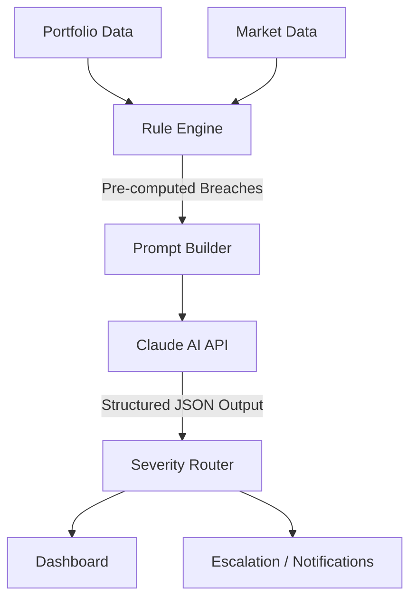

# 🤖 Claude AI Integration Architecture

## Overview

RiskLens AI leverages **Claude 3 Opus / Sonnet** (via the Anthropic API or Amazon Bedrock / Vertex AI, depending on deployment) to provide real-time, explainable risk assessments. Instead of simply flagging rule breaches, the AI acts as a **Virtual Senior Risk Analyst**, explaining *why* a breach matters and *what* to do about it.

This document details the architecture, design patterns, and interaction models used to integrate Claude into the risk pipeline.

---

## Architecture Design

The Claude integration follows a **Hybrid Rule-AI Engine** pattern.



### Why not pure AI?
We do not ask Claude to perform mathematical calculations (e.g., calculating portfolio NAV percentages). LLMs are prone to hallucination in raw mathematics over large datasets. Instead:
1. The **Rule Engine** (Python/Pandas) performs exact calculations and identifies hard limit breaches (e.g., Sector Exposure > 30%).
2. **Claude** receives these pre-computed breaches as context and is tasked purely with **interpretation, rationale generation, and action planning**.

---

## Implementation Details

### The `ClaudeClient` Wrapper

The integration is managed by a dedicated wrapper class: `backend/app/infrastructure/ai/claude_client.py`.

**Responsibilities:**
- Initializing the LangChain `ChatAnthropic` client.
- Managing prompt templating and variable injection.
- Enforcing structured JSON output using Pydantic parsers.
- Handling API retries, rate limits, and fallback logic.

### Structured Output Enforcement

To ensure the frontend and notification systems can programmatically consume Claude's analysis, we enforce a strict JSON output schema.

We use LangChain's `PydanticOutputParser` combined with Claude's function calling / JSON mode capabilities.

```python
class RiskAssessmentOutput(BaseModel):
    severity: Literal["LOW", "MEDIUM", "HIGH", "CRITICAL"]
    confidence: float
    rationale: str
    breach_analysis: List[BreachAnalysis]
    volatility_context: str
    recommended_actions: List[str]
    proposed_trades: List[TradeProposal]
    overall_verdict: str
```

If Claude's output fails to parse into this schema, the `ClaudeClient` utilizes a retry mechanism (via LangChain's `RetryOutputParser`) to prompt Claude to correct its formatting error.

---

## Agentic Auto-Hedger (Phase 2 Feature)

A major feature of the AI engine is the ability to not just recommend actions, but to format them as executable trades (`proposed_trades`).

When Claude identifies a concentration risk, it generates specific hedging or rebalancing trades. The frontend receives this structured data and presents an "Execute AI Hedging Strategy" button to the Portfolio Manager.

### Safety & Human-in-the-Loop
1. **Never Autonomous Execution:** Claude only *proposes* the trades. Execution always requires an explicit click from the PM (Human-in-the-Loop).
2. **Audit Logging:** When a PM executes an AI-proposed trade, the audit log records both the human approval and the specific AI assessment ID that generated the proposal.

---

## Observability & Tracing

We use **LangSmith** to monitor Claude's performance in production.

- **Token Usage Tracking:** Monitoring the cost of analyzing large portfolios.
- **Latency Monitoring:** Ensuring the AI responds within the SLA (typically < 3 seconds) for real-time alerting.
- **Prompt Evaluation:** Capturing production traces to evaluate if Claude is correctly identifying severity based on the provided context. If a PM ignores an alert, we can review the trace to see if the rationale was weak.

## Rate Limiting & Cost Management

- **Caching:** We implement semantic caching for portfolios that haven't changed. If market prices only move slightly and no new limits are breached, we bypass the Claude API call and use the previous rationale, saving API costs and latency.
- **Circuit Breaker:** If the Anthropic API goes down, the application degrades gracefully. The Rule Engine still flags breaches, but the "AI Rationale" section displays a fallback message indicating the AI is temporarily unavailable.
